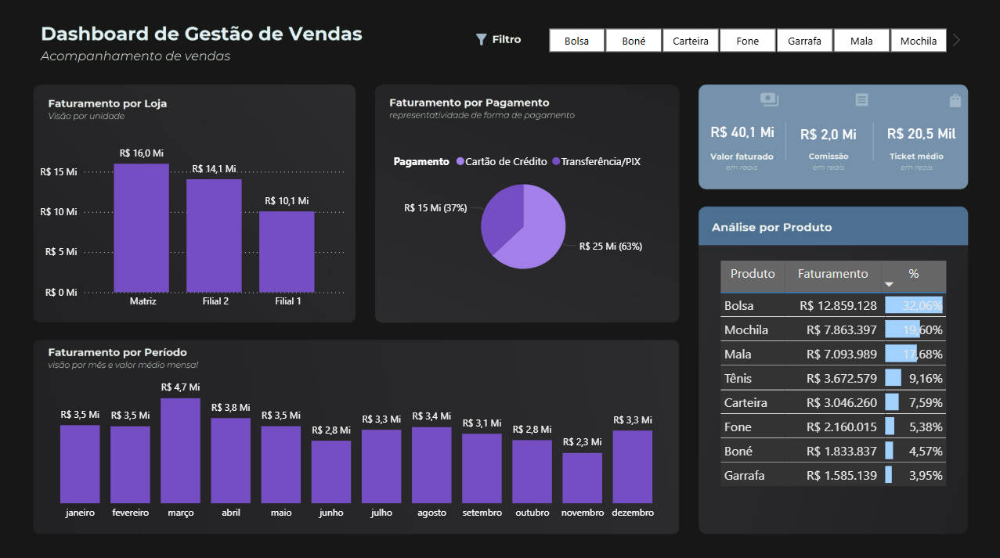

# 📊 Dashboard de Gestão de Vendas - Power BI

Este projeto apresenta um **dashboard interativo desenvolvido no Power BI** para análise de vendas, trazendo insights sobre desempenho por loja, produtos, período e formas de pagamento.

---

## 🔎 Objetivo
O objetivo deste projeto é demonstrar como o Power BI pode ser utilizado para **explorar dados de vendas** e gerar insights que auxiliem na tomada de decisão, como:
- 📍 Identificação das lojas com maior faturamento  
- 💳 Comparativo de formas de pagamento  
- 📦 Produtos mais representativos no faturamento  
- 📆 Evolução mensal das vendas  

---

## 🛠️ Tecnologias Utilizadas
- **Power BI Desktop**  
- **Power Query** para tratamento dos dados  
- **DAX (Data Analysis Expressions)** para criação de medidas  

---

## 📸 Visualização do Dashboard

---

## 🌐 Versão Interativa
Acesse o relatório publicado no Power BI Service:  
👉 [Clique aqui para visualizar](https://app.powerbi.com/view?r=SEU_LINK_PUBLICO)  

  
---

## 📂 Estrutura do Repositório
- `/pbix` → arquivo original do Power BI  
- `/images` → capturas do dashboard  
- `/docs` → versão em PDF  

---

## ✨ Insights Principais
- A **Matriz** lidera o faturamento com R$ 16,0 milhões.  
- O **Cartão de Crédito** representa 63% das vendas.  
- O mês de **março** foi o melhor período, com R$ 4,7 milhões em vendas.  
- O produto **Bolsa** é responsável por mais de 32% do faturamento total.  

---

## 🚀 Próximos Passos
- Incluir novos indicadores de performance (KPIs).  
- Criar comparativos anuais de vendas.  
- Aplicar segmentações mais detalhadas de clientes.  

